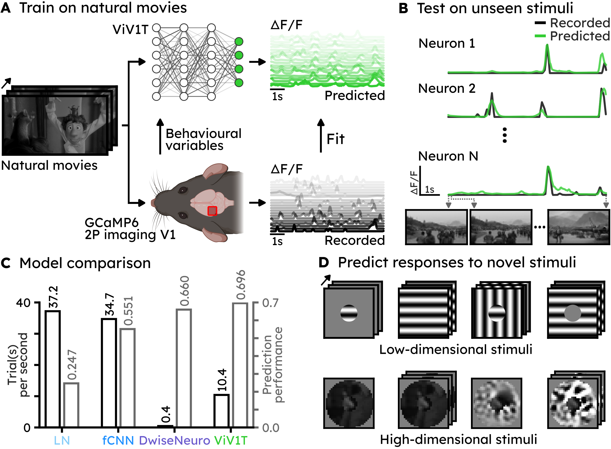
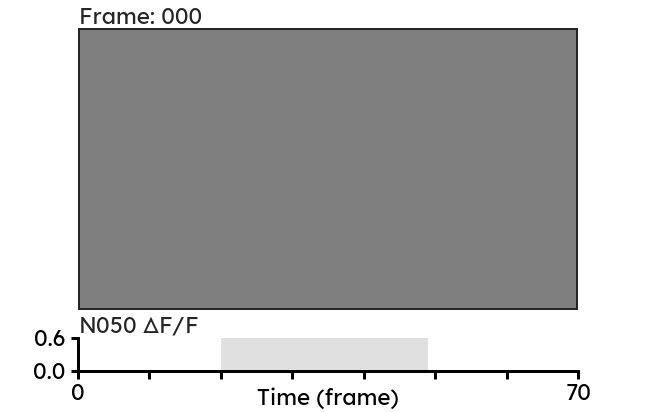

# Movie-trained transformer reveals novel response properties to dynamic stimuli in mouse visual cortex

Code for the ViV1T model and paper "Movie-trained transformer reveals novel response properties to dynamic stimuli in mouse visual cortex".

Contributors: [Bryan M. Li](https://bryanli.io), [Wolf De Wulf](https://wulfdewolf.github.io/), [Danai Katsanevaki](https://sidb.org.uk/nathalie-rochefort/danai-katsanevaki), [Arno Onken](https://homepages.inf.ed.ac.uk/aonken/), [Nathalie L. Rochefort](https://rochefortlab.co.uk/).



<table>
  <thead>
    <tr>
      <th rowspan="2">Most exciting centre</th>
      <th colspan="3">Most exciting surrounds</th>
    </tr>
    <tr>
      <th>Grating video</th>
      <th>Natural video</th>
      <th>Generated video</th>
    </tr>
  </thead>
  <tbody>
    <tr>
      <td width="25%"></td>
      <td width="25%"></td>
      <td width="25%"></td>
      <td width="25%"></td>
    </tr>
  </tbody>
</table>

[most_exciting_stimulus/README.md](most_exciting_stimulus/README.md) shows more examples of model-selected and model-generated most exciting centre surround stimuli (MEIs, MEVs), which we then verified in semi-closed-loop _in vivo_ experiments.

---

## Acknowledgments

We sincerely thank [Turishcheva et al.](https://arxiv.org/abs/2305.19654) for organising the [Sensorium 2023 challenge](https://www.sensorium-competition.net/) and for making their high-quality, large-scale mouse V1 recordings publicly available. The structure of this codebase is based on and inspired by [bryanlimy/V1T](https://github.com/bryanlimy/V1T), [bryanlimy/ViV1T](https://github.com/bryanlimy/ViV1T), [ecker-lab/sensorium_2023](https://github.com/ecker-lab/sensorium_2023), [sinzlab/neuralpredictors](https://github.com/sinzlab/neuralpredictors) and [sinzlab/nnfabrik](https://github.com/sinzlab/nnfabrik).

---

## File structure
The codebase is divided into its own (mostly) self-contained folders to evaluate different aspects/properties of the trained model (direction tuning, size tuning, etc.). The following list shows the overall organisation of the codebase and the code used for each figure and/or analysis presented in the paper.
- Check [data/README.md](data/README.md) for more information about the datasets and how to store them.
- [train.py](train.py) is the main pipeline to train the model.
- [predict.py](predict.py) is the code to inference the trained model on the test set(s).
- [viv1t/](viv1t) contains code to construct the model, save and load model weights, compute various metrics to evaluate the model, generate low-dimensional parametric stimuli, etc.
- [misc/](misc) contains scripts for extracting metadata and visualisations that are useful for all the analyses. See [misc/README.md](misc/README.md), you might find some of the scripts helpful too.
- [tuning_retinotopy/](tuning_retinotopy) estimates the artificial receptive fields (aRFs) of each _in silico_ neuron the models were trained on (**Figure 7**). The aRFs are used to estimate the centre of the receptive field for subsequent analyses. See [tuning_retinotopy/README.md](tuning_retinotopy/README.md).
- [tuning_direction/](tuning_direction) evaluates the direction tuning and spatial organisation of the trained models (**Figure 2**). See [tuning_direction/README.md](tuning_direction/README.md).
- [tuning_contextual_modulation/](tuning_contextual_modulation) evaluates the centre-surround contextual modulation properties of the trained models, mostly replicating the _in vivo_ experiments from [Keller et al. 2020](https://www.cell.com/neuron/fulltext/S0896-6273(20)30891-6) using the movie-trained model (**Figure 2**). See [tuning_contextual_modulation/README.md](tuning_contextual_modulation/README.md).
- [tuning_feedbackRF/](tuning_feedbackRF) evaluates the feedback-dependent contextual modulation of the trained models, mostly replicating the _in vivo_ experiments from [Keller et al. 2020](https://www.nature.com/articles/s41586-020-2319-4) using the movie-trained model (**Figure 3**). See [tuning_feedbackRF/README.md](tuning_feedbackRF/README.md).
- [most_exciting_stimulus/](most_exciting_stimulus) contains code to find the most exciting grating and natural centre-surround stimuli to single neuron and population responses. It also contains the code to generate the most exciting images and videos (MEIs and MEVs, **Figure 5** and **Supplemental Figure 4**). See [most_exciting_stimulus/README.md](most_exciting_stimulus/README.md).
- [in_vivo_analysis/](in_vivo_analysis) contains code to analyse the _in vivo_ experiments we conducted to verify the predictions made by the movie-trained ViV1T, including low vs. high contrast centre-surround contextual modulation, generating MEIs and MEVs, etc. (**Figure 4**, **Figure 5**, **Supplemental Figure 3** and **Supplemental Figure 4**). See [in_vivo_analysis/README.md](in_vivo_analysis/README.md).
- Check [.gitignore](.gitignore) for the ignored files.

```
ViV1T-closed-loop/
  data/
    sensorium/
    rochefort-lab/
    README.md
    ...
  docker/
  figures/
  in_vivo_analysis/
  misc/
  most_exciting_stimulus/
  tuning_contextual_modulation/
  tuning_direction/
  tuning_feedbackRF/
  tuning_retinotopy/
  viv1t/
    data/
    model/
    most_exciting_stimulus/
    utils/
    __init__.py
    checkpoint.py
    criterions.py
    metrics.py
    optimizer.py
    scheduler.py
  .gitignore
  pyproject.toml
  README.md
  predict.py
  train.py
  ...
```
---

## Installation
- Create a new [conda](https://docs.conda.io/en/latest/miniconda.html) environment in Python 3.12.
  ```bash
  conda create -n viv1t python=3.12
  ```
- Activate the `viv1t` virtual environment
  ```bash
  conda activate viv1t
  ```
- Install all the relevant packages with:
  ```bash
  conda install ffmpeg -c conda-forge 
  pip install -e .
  ```
- Alternatively, you can see the dockerfile we used [docker/Dockerfile](docker/Dockerfile).

### Train model
- Activate the `viv1t` environment
  ```
  conda activate viv1t
  ```
- Train the default ViV1T model. The model checkpoints and logs will be stored in `runs/001_viv1t`.
  ```
  train.py --data_dir=data/ --output_dir=runs/001_viv1t --core=vivit --core_behavior_mode=2 --core_use_causal_attention --core_parallel_attention --readout=gaussian --output_mode=1 --schedule_free --compile --batch_size=1 --wandb=vivit --clear_output_dir
  ```
- Check `--help` for all available arguments
  ```
  > python train.py --help
  usage: train.py [-h] [--data_dir DATA_DIR] --output_dir OUTPUT_DIR [--transform_input {0,1,2}] [--transform_output {0,1,2}]
                  [--center_crop CENTER_CROP] [--mouse_ids MOUSE_IDS [MOUSE_IDS ...]] [--limit_data LIMIT_DATA]
                  [--limit_neurons LIMIT_NEURONS] [--num_workers NUM_WORKERS] [--epochs EPOCHS] [--batch_size BATCH_SIZE]
                  [--micro_batch_size MICRO_BATCH_SIZE] [--crop_frame CROP_FRAME] [--device {cpu,cuda,mps}] [--seed SEED]
                  [--deterministic] [--autocast {auto,disable,enable}] [--grad_checkpointing {0,1}] [--restore RESTORE]
                  [--adam_beta1 ADAM_BETA1] [--adam_beta2 ADAM_BETA2] [--adam_eps ADAM_EPS] [--schedule_free]
                  [--adam_warmup_steps ADAM_WARMUP_STEPS] [--adam_r ADAM_R] [--adam_weight_lr_power ADAM_WEIGHT_LR_POWER]
                  [--criterion CRITERION] [--ds_scale {0,1}] [--clip_grad CLIP_GRAD] [--wandb WANDB] [--wandb_id WANDB_ID]
                  [--clear_output_dir] [--verbose {0,1,2,3}] --core CORE [--pretrained_core PRETRAINED_CORE] [--compile] --readout
                  READOUT [--shifter_mode {0,1,2}] [--output_mode {0,1,2,3,4}]
  
  options:
    -h, --help            show this help message and exit
    --data_dir DATA_DIR   path to directory where the dataset is stored.
    --output_dir OUTPUT_DIR
                          path to directory to log training performance and model checkpoint.
    --transform_input {0,1,2}
                          input transformation
                          0: no transformation
                          1: standardize input
                          2: normalize input
    --transform_output {0,1,2}
                          output transformation
                          0: no transformation
                          1: standardize output per neuron
                          2: normalize output per neuron
    --center_crop CENTER_CROP
                          center crop the video frame to center_crop percentage.
    --mouse_ids MOUSE_IDS [MOUSE_IDS ...]
                          Mouse to use for training. By default we use all 10 mice from the Sensorium 2023 dataset
    --limit_data LIMIT_DATA
                          limit the number of training samples.
    --limit_neurons LIMIT_NEURONS
                          limit the number of neurons to model.
    --num_workers NUM_WORKERS
                          number of workers for DataLoader.
    --epochs EPOCHS       maximum epochs to train the model.
    --batch_size BATCH_SIZE
    --micro_batch_size MICRO_BATCH_SIZE
                          micro batch size to train the model. if the model is being trained on CUDA device and micro batch size 0 is provided, then automatically increase micro batch size until OOM.
    --crop_frame CROP_FRAME
                          number of frames to take from each trial.
    --device {cpu,cuda,mps}
                          Device to use for computation. use the best available device if --device is not specified.
    --seed SEED           random seed.
    --deterministic       use deterministic algorithms in PyTorch
    --autocast {auto,disable,enable}
                          Use torch.autocast in torch.bfloat16 when training the model.
    --grad_checkpointing {0,1}
                          Enable gradient checkpointing for supported models if set to 1.
    --restore RESTORE     pretrained model to restore from before training begins.
    --adam_beta1 ADAM_BETA1
    --adam_beta2 ADAM_BETA2
    --adam_eps ADAM_EPS
    --schedule_free       use schedule-free optimizer
    --adam_warmup_steps ADAM_WARMUP_STEPS
    --adam_r ADAM_R
    --adam_weight_lr_power ADAM_WEIGHT_LR_POWER
    --criterion CRITERION
                          criterion (loss function) to use.
    --ds_scale {0,1}      scale loss by the size of the dataset
    --clip_grad CLIP_GRAD
                          clip gradient norm:
                          0: disable gradient clipping
                          -1: AutoClip (Seetharaman et al. 2020)
                          >0: clip to a specific value.
    --wandb WANDB         wandb group name, disable wandb logging if not provided.
    --wandb_id WANDB_ID   wandb run ID to resume from.
    --clear_output_dir    overwrite content in --output_dir
    --verbose {0,1,2,3}
    --core CORE           The core module to use.
    --pretrained_core PRETRAINED_CORE
                          Path to directory where the pre-trained model is stored
    --compile             torch.compile (part of) the model for faster training
    --readout READOUT     The readout module to use.
    --shifter_mode {0,1,2}
                          0: disable shifter
                          1: learn shift from pupil center
                          2: learn shift from pupil center and behavior variables
    --output_mode {0,1,2,3,4}
                          Output activation:
                          0: no activation
                          1: ELU + 1 activation
                          2: Exponential activation
                          3: SoftPlus activation with learnable beta value
                          4: sigmoid activation
  ```
