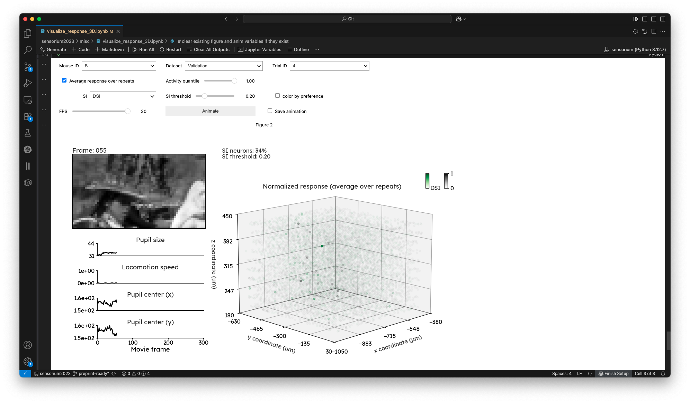

The `misc/` folder mostly consist of helper scripts that do not belong to a specific category/part of the presented analysis in the paper.

- [assign_stimulus_ids.py](assign_stimulus_ids.py) assign a stimulus type ID to each video. This is needed to separate metric calculation for each stimulus type.
  ```
  STIMULUS_TYPES = {
      0: "movie",
      1: "directional pink noise",
      2: "gaussian dots",
      3: "random dot kinematogram",
      4: "drifting gabor",
      5: "image",
  }
  ```
- [assign_video_ids.py](assign_video_ids.py) assign a video ID to each unique stimulus. This is needed to computed trial-averaged correlations.
- [calculate_model_parameters.py](calculate_model_parameters.py) load a model checkpoint and return the number of parameters/weights it has.
- [evaluate_response.py](evaluate_response.py) compute all the metrics between predicted and recorded responses (single trial correlation, normalized correlation, mean squared error, etc.). Each metric is calculated based on the stimulus type. The results are saved into `yaml` and `parquet` files for subsequent analysis. For instance, we need the correlation of the validation set to select reliable neurons which is used to generated most-exciting stimulus. Note that this file read from the `h5` files saved by [predict.py](../predict.py) and [save_response.py](../data/save_response.py).
- [performance_by_depth.py](performance_by_depth.py) compute performance metrics by the z-axis (depth) of the neurons according to their anatomical coordinates. 
- [visualize_limit_data.py](visualize_limit_data.py) and [visualize_limit_data_and_neurons.py](visualize_limit_data.py) plot the prediction performance of the model trained with varying training data and neurons (e.g. **Supplemental Figure 5**)
- [visualize_response_3D.ipynb](visualize_response_3D.ipynb) visualize response to stimuli as a 3D scatter plot, based on the anatomical coordinates of the neurons. You can also filter neurons by their OSI and DSI.
  
- [visualize_sensorium_dataset.ipynb](visualize_sensorium_dataset.ipynb) notebook to visualize simply statistics and metadata for the Sensorium 2023 dataset
- [visualize_sensorium_response_statistics.ipynb](visualize_sensorium_response_statistics.ipynb) notebook to visualize the statistics of the calcium responses in the Sensorium 2023 dataset.
- [visualize_tokenizer.ipynb](visualize_tokenizer.ipynb) visualize the tokenization methods used in ViV1T.