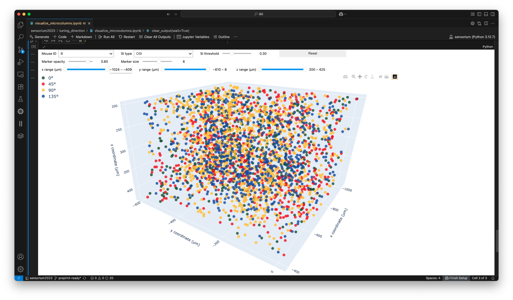

The `tuning_direction/` folder mostly consist of code to compute the direction/orientation tuning and spatial organization of mouse V1 presented in **Figure 2**, **Supplemental Figure 1** and **Supplemental Figure 2**.

- [estimate_selectivity_indexes.py](estimate_selectivity_indexes.py) estimate the direction and orientation selectivity indexes (DSI and OSI) of the recorded data as well as predictions from different models.
- [extract_gabor_features.py](extract_gabor_features.py) extract directional Gabor grating parameters from the drifting Gabor stimuli in the Sensorium 2023 as their ground-truth was not shared.
- [visualize_preference_differences.py](visualize_preference_differences.py) visualize the difference in direction tuning preference between recorded and predicted responses (**Figure 2D**).
- [visualize_selectivity_distribution.py](visualize_selectivity_distributions.py) visualize the OSI/DSI distributions.
- [visualize_tuning_curve.py](visualize_tuning_curve.py) visualize the tuning curves of each neuron (**Figure 2A**).
- [visualize_tuning_curve_correlation.py](visualize_tuning_curve_correlation.py) visualize the tuning curve correlations between recorded and predicted data (**Figure 2B**).
[visualize_tuning_width.py](visualize_tuning_width.py) visualize tuning width (**Figure 2C**).
- [estimate_tuning_similarity.py](estimate_tuning_similarity.py) estimate the tuning similarity of the neurons as described in [Ringach et al. 2016](https://www.nature.com/articles/ncomms12270). The results are saved to `parquet` files for quicker plotting.
- [visualize_tuning_similarity.py](visualize_tuning_similarity.py) visualize tuning similarity, as computed in [estimate_tuning_similarity.py](estimate_tuning_similarity.py), as [Ringach et al. 2016](https://www.nature.com/articles/ncomms12270) (**Supplemental Figure 1**).
- [visualize_microcolumns.ipynb](visualize_microcolumns.ipynb) visualize micro-columns in a 3D scatter plot based on their direction tuning preference. You can filter neurons by OSI/DSI, xyz coordinates, etc.
  
- [visualize_tuning_similarity_by_plane.py](visualize_tuning_similarity_by_plane.py) visualize tuning similarity by neuron plane (depth or z-axis).
